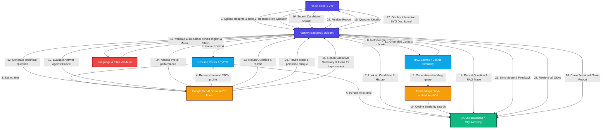
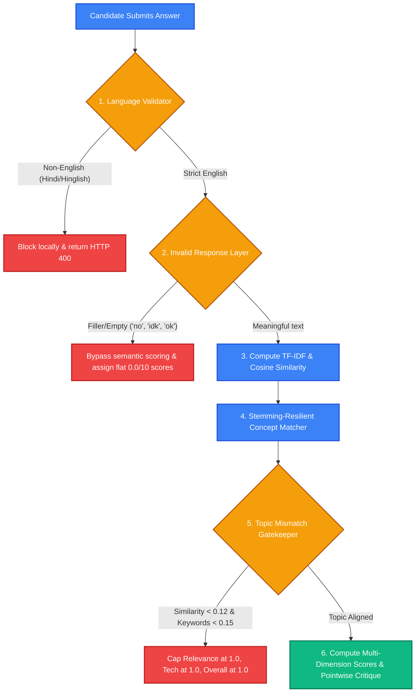

# TalentAI - Intelligent Role-Based Candidate Screening System

TalentAI is a production-ready, full-stack, AI-powered role-based candidate technical screening system. It simulates a structured technical interview where questions are dynamically generated based on a candidate's resume, their target job role, and a role-specific textbook knowledge base using a Retrieval-Augmented Generation (RAG) pipeline.

---

##  System Architecture & Workflow Flowchart

The following flowchart illustrates the complete data flow, from resume ingestion to dynamic evaluation and final executive reporting:



---

##  Advanced NLP Answer Evaluation Pipeline

To prevent false-positive grading, TalentAI incorporates a multi-layer evaluation pipeline that intercept inputs locally before calculating semantic metrics.



### 1. Hybrid Language Validation Gatekeeper (Local Layer)
- **Devanagari script detector**: Uses unicode matching (`[\u0900-\u097F]+`) to block native Hindi inputs.
- **Phonetic Hinglish regex filter**: Scans for 40+ Romanized Hindi keywords (e.g. *mene*, *kiya*, *hai*, *toh*, *sath*).
- **Cost-savings**: Rejects invalid inputs locally with an `HTTP 400 Bad Request` before calling LLMs, preventing cost leaks.

### 2. Invalid Response Pre-Evaluation check
- Detects empty responses, under 4-word inputs, or filler replies (e.g. *"no"*, *"idk"*, *"ok"*, *"hmm"*, *"nothing"*, *"don't know"*).
- Bypasses semantic scoring immediately, assigning a flat **`0.0/10`** score across all categories (Technical Knowledge, Relevance, Clarity, Completeness) and generating dedicated missing-explanation assessment points.

### 3. Topic Mismatch Gatekeeper & Stemming-Resilient Matcher
- **TF-IDF Semantic Cosine Similarity**: Computes mathematical overlap between candidate response and the expected answer summary using `scikit-learn`.
- **Concept Coverage**: Extracts content words from expected concepts, filters stopwords, and performs prefix matching to evaluate key elements (e.g. downsampling, spatial features).
- **Mismatch Cap**: If similarity is $<0.12$ and keyword match ratio is $<0.15$ (e.g., explaining backend Flask when asked about CNN layers), it flags a mismatch and caps Relevance at `1.0/10`, Technical at `1.0/10`, and Completeness at `0.0/10`, outputting a pointwise mismatch critique.

### 4. Communication Quality Metrics
Grades clarity out of 10.0 based on structural complexity (multi-sentence structure), connector usage (*because*, *therefore*, *consequently*), and vocabulary diversity, deducting points for bad all-lowercase formatting.

---

##  Key Features

1. **AI-Driven Resume Parsing**: Processes uploaded PDF/TXT resumes, dynamically extracting skills, experience level, and domain exposure via Gemini.
2. **Context-Grounded Question Generation (RAG)**: Queries a role-specific SQLite vector store containing textbook chapters to retrieve relevant concepts, custom-tailoring each question to both the syllabus and the candidate's background.
3. **Adaptive Difficulty Flow**: Adjusts question depth based on experience level (`junior`, `mid`, `senior`) and previous Q&A topics to cover the syllabus effectively without repetition.
4. **Detailed Technical Rubrics**: Evaluates candidate responses against dynamic grading guidelines. Assigns critical scores (0.0 to 10.0) and generates 3-4 sentences of descriptive, constructive technical feedback.
5. **Transparent Audit Trail**: Traces matching context metadata (document names, chunk IDs, and cosine similarity match scores) linking each question directly to its source textbook block.
6. **Executive Analytics Dashboard**: Compiles session data, rendering custom executive summaries, circular SVG metrics, evaluated strengths list, and targeted improvement areas.
7. **Offline Mock Fallback System**: Intercepts missing API configurations or connection limits, seamlessly falling back to high-fidelity simulated questions, grading, and dynamic positive vector indexing to ensure 100% stable runs.

---

##  Project Structure

```
ai_candidate_screener/
├── backend/                       # Python FastAPI Backend
│   ├── app/
│   │   ├── rag/                   # RAG similarity calculations & loader
│   │   │   ├── chunker.py
│   │   │   ├── loader.py
│   │   │   ├── rag_service.py
│   │   │   └── vector_store.py
│   │   ├── services/              # LLM services & state manager
│   │   │   ├── resume_parser.py
│   │   │   ├── llm_service.py
│   │   │   ├── session_manager.py
│   │   │   └── validator.py       # Language Validation Service
│   │   ├── main.py                # Router definitions
│   │   ├── models.py              # DB schema mappings
│   │   ├── config.py              # Pydantic settings
│   │   └── database.py            # SQLite session factories
│   ├── knowledge_base/            # Syllabus textbook files
│   ├── .env                       # Secrets and key config
│   ├── requirements.txt           # Python dependency locks
│   └── ingest_knowledge.py        # Ingestion script to chunk and embed vectors
├── frontend/                      # React SPA (Vite)
│   ├── src/
│   │   ├── components/            # UI components (Upload, IDE, SVG Charts)
│   │   │   ├── ResumeUpload.jsx
│   │   │   ├── InterviewStage.jsx
│   │   │   └── ReportStage.jsx
│   │   ├── App.jsx
│   │   ├── index.css              # Custom styling definitions
│   │   └── main.jsx
│   ├── index.html
│   ├── package.json               # Node dependency locks
│   └── vite.config.js             # Client proxy configuration
├── verify_system.py               # E2E integration test suite
├── verify_evaluator_mismatch.py   # E2E semantic mismatch/invalid response test suite
└── README.md                      # System documentation
```

---

##  Technical Design Decisions

1. **Embedded SQLite Vector Search**: Rather than adding complex external vector database dependencies (like Chroma/Faiss) which frequently fail to compile in restricted sandboxes, we implemented cosine similarity search directly inside SQLite. High-dimensional embeddings (`text-embedding-004`) are saved as JSON arrays, loaded into memory, and evaluated in native Python. This ensures the project is 100% portable and has zero compilation issues.
2. **FastAPI for Async Routing**: FastAPI provides an asynchronous backend with automatic OpenAPI documentation (`/docs`) and fast JSON serialization.
3. **Pydantic Settings**: Manages environment variable validation (`.env`) with automatic type coercions.
4. **Vite React & Vanilla CSS**: Hand-crafted CSS variables (`index.css`) deliver a modern, custom glassmorphism dark-mode layout without loading heavy external UI library assets.

---

## 🚀 Installation & Setup

### Prerequisites
- **Python 3.9+**
- **Node.js 16+**

### Step 1: Install Python Dependencies
```bash
cd backend
pip install -r requirements.txt
```

### Step 2: Configure Environment Variables
Create or open the `.env` file in the `backend/` directory:
```env
GEMINI_API_KEY=your_actual_gemini_api_key_here
DATABASE_URL=sqlite:///./candidate_screener.db
MAX_QUESTIONS=5
```
*Note: If no API key is provided, the backend automatically falls back to **Mock Mode**, generating simulated questions and grading answers so you can test the application offline.*

### Step 3: Run RAG Ingestion
Populate the database with chunked textbook content and precompute vector embeddings:
```bash
cd backend
python ingest_knowledge.py
```

### Step 4: Run E2E Test Suites
Verify that all system operations (RAG search, resume parsing, language validation, invalid response filters, and topic mismatch scoring) pass successfully:
```bash
# 1. Verify general system flow
python verify_system.py

# 2. Verify topic mismatch and invalid responses
python verify_evaluator_mismatch.py
```
*All tests should report `OK` or `100% SUCCESS`.*

### Step 5: Start Servers

1. **Start Backend Server**:
   ```bash
   cd backend
   uvicorn app.main:app --reload
   ```
2. **Start Frontend Server** (in a new terminal tab):
   ```bash
   cd frontend
   npm install
   npm run dev
   ```
   Open **`http://localhost:3000`** to launch the screening application!

---

## 🔌 API Specifications

- **`POST /api/sessions/start`**: Initiates a session. Accepts a multi-part form carrying `role` (string) and `file` (resume PDF/TXT). Returns the session ID.
- **`POST /api/sessions/{session_id}/next-question`**: Queries the RAG index, pulls matching context chunks, invokes Gemini, and generates the next interview question.
- **`POST /api/sessions/{session_id}/submit-answer`**: Grades the candidate's answer (1-10) using Gemini and returns evaluation feedback. Concludes session when maximum questions are reached.
- **`GET /api/sessions/{session_id}/report`**: Aggregates interview questions, answers, scores, RAG source traces, and requests a final candidate strengths/weaknesses summary from Gemini.
- **`POST /api/sessions/{session_id}/end`**: Concludes the screening early and generates the candidate report.

---

##  Step-by-Step GitHub Upload Instructions

Follow these commands to push your project directory up to a new GitHub repository:

1. **Create Repository**: Go to [github.com/new](https://github.com/new) and create a public or private repository (do **not** check "Add a README file").
2. **Run Git Commands**:
   ```bash
   # Navigate to the project root directory
   cd C:\Users\abc\.gemini\antigravity\scratch\ai_candidate_screener
   
   # Initialize local git repository
   git init
   
   # Add files to staging index (automatically respects the existing .gitignore)
   git add .
   
   # Commit changes
   git commit -m "feat: complete full-stack talentai candidate screener with advanced nlp evaluations"
   
   # Point branch to main
   git branch -M main
   
   # Connect to remote repository (replace with your exact GitHub link)
   git remote add origin https://github.com/YOUR_USERNAME/YOUR_REPOSITORY_NAME.git
   
   # Push files
   git push -u origin main
   ```
